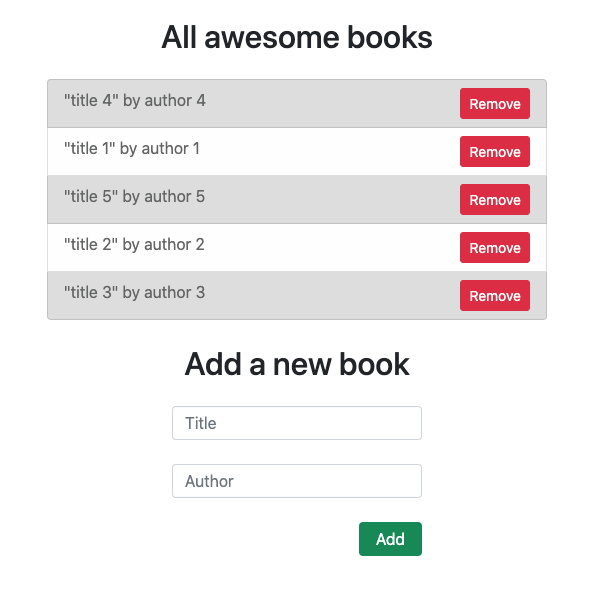

<h1 align="center">Awesome Books</h1>

## About The Project

Javascript practice to store, display and remove objects from localStorage and UI.



### Built With

* [HTML](https://www.w3schools.com/html/)
* [CSS](https://www.w3schools.com/css/)
* [JS](https://www.javascript.com/)

### Live Demo Link

Check [this](https://ibrohimrasulov.github.io/awesomebooks/) live demo link

## Authors

👤 **Ibrohim Rasulov**

- GitHub: [@IbrohimRasulov](https://github.com/IbrohimRasulov)
- Twitter: [@IbrohimRasu1ov](https://twitter.com/IbrohimRasu1ov)
- LinkedIn: [LinkedIn](https://www.linkedin.com/in/ibrohim-rasulov-a88352209/)

## Getting Started

* You will not need additional instructions on installing Prerequisites.
* In case you have node_modules on your folder Add them to .gitignore file before you a push.

### Prerequisites

* No prerequisites needed for this project.


### Installation

1. Clone the repo

2. Install NPM packages
   ```sh
   npm install
   ```

## Usage

* Practice basic UI usage with Javascript objects and classes.


## Contributing

Contributions are what make the open source community such an amazing place to be learn, inspire, and create. Any contributions you make are **greatly appreciated**.

1. Fork the Project
2. Create your Feature Branch (`git checkout -b feature/NewFeature`)
3. Commit your Changes (`git commit -m 'Add some NewFeature'`)
